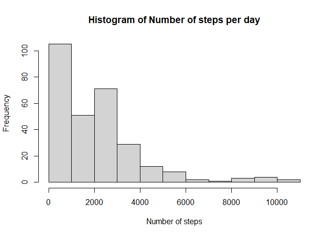
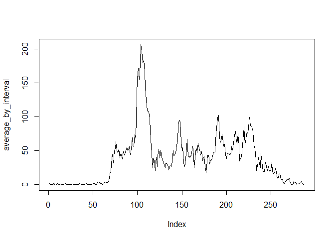
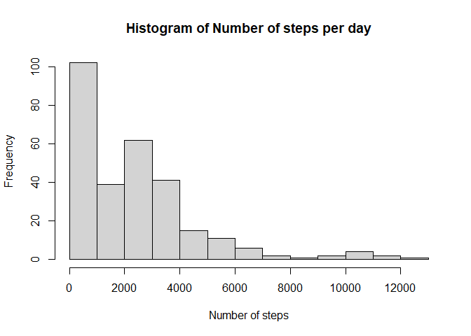
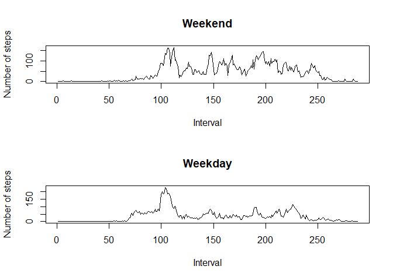

## Loading and preprocessing the data
First, the *activity* data will be loaded.

```r
setwd("C:/Users/dk/Documents/Coursera/Data science/Reproducible Research/")

activity=read.csv("activity.csv")
```

The first 6 lines of the file are:

```r
head(activity)
```

```
##   steps       date interval
## 1    NA 2012-10-01        0
## 2    NA 2012-10-01        5
## 3    NA 2012-10-01       10
## 4    NA 2012-10-01       15
## 5    NA 2012-10-01       20
## 6    NA 2012-10-01       25
```

## What is mean total number of steps taken per day?

```r
# convert table to format (Day x Interval)
day_mat=matrix(activity$steps, ncol=24*12, byrow = T)

## aggregate by day
daily_steps=apply(day_mat, 2, sum, na.rm=T)

mean_steps=mean(daily_steps, na.rm=T)

median_steps=median(daily_steps, na.rm=T)

hist(daily_steps, main="Histogram of Number of steps per day", xlab="Number of steps")
```

<!-- -->

The mean number of steps is 1981.2777778 and the median number is 1808.


## What is the average daily activity pattern?

```r
average_by_interval=tapply(activity$steps, activity$interval, mean, na.rm=T)

plot(average_by_interval, type="l")
```

<!-- -->

```r
which_max_int=activity[which.max(average_by_interval), "interval"]
```

The interval with the maximum average number of steps is interval 835.


## Imputing missing values

```r
num_NAs=sum(is.na(activity$steps))
```

In total there 2304 missing values in the dataset.


```r
## fill in the missing values with the average of that interval across all days

# first copy the dataset
activity_filled=activity

# find missing values
which_NA_ind=which(is.na(day_mat), arr.ind = T)
which_NA_ind_ordered=which_NA_ind[order(which_NA_ind[,1], which_NA_ind[,2]),]
which_NA=which(is.na(activity_filled$steps))

activity_filled$steps[which_NA]=average_by_interval[which_NA_ind_ordered[,2]]


# using the filled dataset convert table to format (Day x Interval)
day_mat_filled=matrix(activity_filled$steps, ncol=24*12, byrow = T)

## aggregate by day
daily_steps_filled=apply(day_mat_filled, 2, sum, na.rm=T)
## calculate mean and median
mean_steps_filled=mean(daily_steps_filled, na.rm=T)
median_steps_filled=median(daily_steps_filled, na.rm=T)

## Plot histogram
hist(daily_steps_filled, main="Histogram of Number of steps per day", xlab="Number of steps")
```

<!-- -->

The mean number of steps is 2280.3385744 and the median number is 2080.9056604 in the case of the filled dataset.
By filling the dataset, the number of steps increases because there are no NAs when we aggregate from 5-minutes to daily time series.


## Are there differences in activity patterns between weekdays and weekends?


```r
## convert to Date format
activity_filled$date=as.Date(activity_filled$date)
# find weekends
what_day=weekdays(activity_filled$date)
weekend=ifelse(what_day %in% c("Sunday", "Saturday"), 1, 0)

activity_filled$weekend=as.factor(weekend)

weekend_activity=tapply(activity_filled[activity_filled$weekend==1, "steps"], activity_filled[activity_filled$weekend==1, "interval"], mean, na.rm=T)

weekday_activity=tapply(activity_filled[activity_filled$weekend==0, "steps"], activity_filled[activity_filled$weekend==0, "interval"], mean, na.rm=T)

## create plot
par(mfrow=c(2,1))
plot(weekend_activity, type="l", main="Weekend", xlab="Interval", ylab="Number of steps")
plot(weekday_activity, type="l", main="Weekday", xlab="Interval", ylab="Number of steps")
```

<!-- -->

